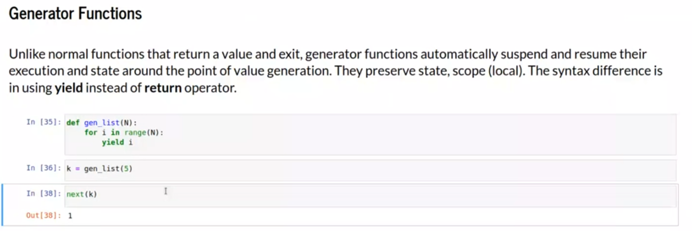

KISS
KISS в программировании — это принцип проектирования и разработки, суть которого заключается в том, чтобы создавать простые и понятные решения, избегая избыточной сложности
Аббревиатура KISS расшифровывается как «keep it short and simple» — «делай кратко и просто»

Определение генераторов

